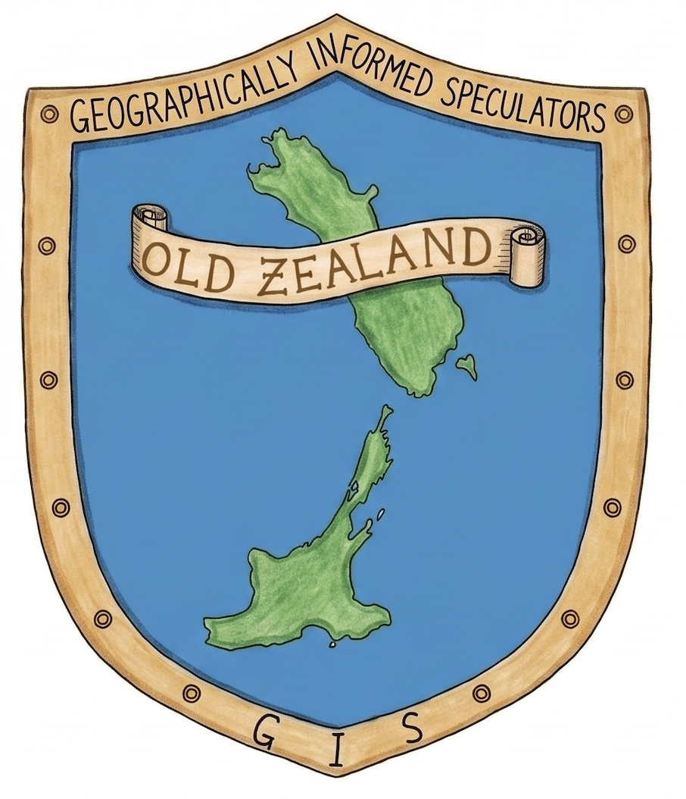
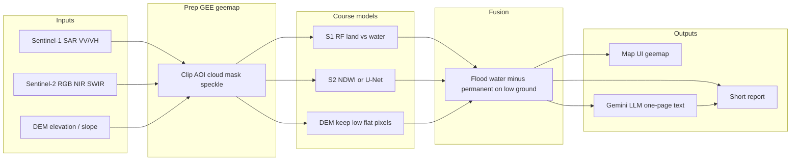

#  Geographically Informed Speculators (GIS)

GEOG761 group project: mapping **flood and inundation extent** after a disaster, as the entry point for choosing a sea-logistics / HA-DR site.

This repository is documentation-only for now. Application code (map UI, processing, Gemini report) will be added step by step.

---

## The problem

Selecting a suitable site for logistics supply from sea, immediately following a disaster event requiring HA/DR support.

**Scope:** focus on flood and inundation extent as the entry point.

- Ports may fail
- Beach landing becomes the fallback
- Roads destroyed
- Communities and islands cut off
- Survey data outdated
- Pre-event knowledge no longer reliable

---

## Observation and method

**Mapping flood extents using Sentinel-1**

1. Sentinel-1 SAR before and after the event → difference
2. Change in backscatter → threshold / classify
3. Separate water from land → inundation extent
4. Newly flooded area

- SAR penetrates cloud, making it reliable during storm and cyclone events when optical imagery is often unusable.
- Water gives a consistent radar response anywhere, so the method should generalise rather than overfit to one site.
- Sentinel-2 may be added as a secondary layer where imagery is clear.

Course water-detection methods (thresholds and/or Random Forest / Lab 5 U-Net) are applied to Sentinel-1 and Sentinel-2, then constrained with a DEM.

---

## Draft architecture



**Logical proposition:** flood = Sentinel-1 and/or Sentinel-2 water, minus permanent water, on low / flat ground.

**Event trigger (pitch context):** MetService / news. Implementation will start from a user-selected AOI and date range rather than a live alert feed.

---

## Planned UI (not implemented yet)

- Team name **Geographically Informed Speculators** and logo at the top of the page. Drop the logo in [`assets/logo/`](assets/logo/) (see that folder’s README).
- Input: select an area of interest (AOI) on the map.
- Processing module: clip, cloud mask, speckle filter, course models, fusion.
- Output on the same UI: geemap flood polygon / layers, plus a short report.
- **Gemini** turns map stats into one page of explainable text (no RAG).

---

## Expected product and risks

**Product**

- A map of flood and inundation extent for a chosen area and date range, produced from before and after Sentinel-1 imagery.
- A notebook or GitHub repository containing the code.
- Run on past flood events to show the method works.
- A partner can adapt it to their own SAR data.

**Risks:** revisit rate, training data, compute limits.

---

## Course mapping

| Pipeline step | Course source |
|---|---|
| GEE + geemap ingest and map display | Lab 1 |
| Sentinel-2 pixel ML, spectral indices (e.g. NDWI), Random Forest | Lecture 2, Lab 2 |
| Cloud-cleared Sentinel-2 composite | Lab 3 |
| Sentinel-1 land vs water (VV/VH, RF, speckle `focal_mean`) | Lecture 6 (same exercise in Lecture 8) |
| Optional U-Net surface water on 6-band Sentinel-2 | Lab 5 (deep learning idea: Lecture 5 / Lab 4) |
| DEM keep low / flat pixels | Extra GIS prior (not a 761 exercise) |
| Fusion overlay | Project novelty |

**Honesty line:** Lecture 6 classifies land vs water with **Random Forest on VV/VH**, not a fixed SAR dB threshold. A backscatter threshold, if used, is a project choice. Water is dark in calm SAR; wind and speckle are why the lecture does not treat water as one dB cutoff.

---

## Repository layout

```text
GEOG761-GIS/
  README.md
  pyproject.toml
  assets/logo/                 # team logo
  notebooks/                   # test each input layer in GEE / geemap
    layer_config.py            # shared AOI, dates, GEE project
    01_sentinel1_layer.ipynb   # Sentinel-1 VV/VH
    02_sentinel2_layer.ipynb   # Sentinel-2 RGB / NIR / SWIR
    03_dem_layer.ipynb         # SRTM elevation / slope
```

Later: `ui/`, `processing/`, and `output/` when the map UI and fusion pipeline are added.
