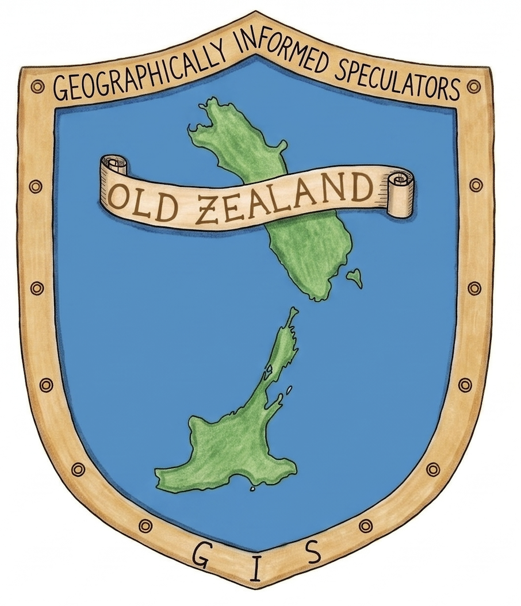
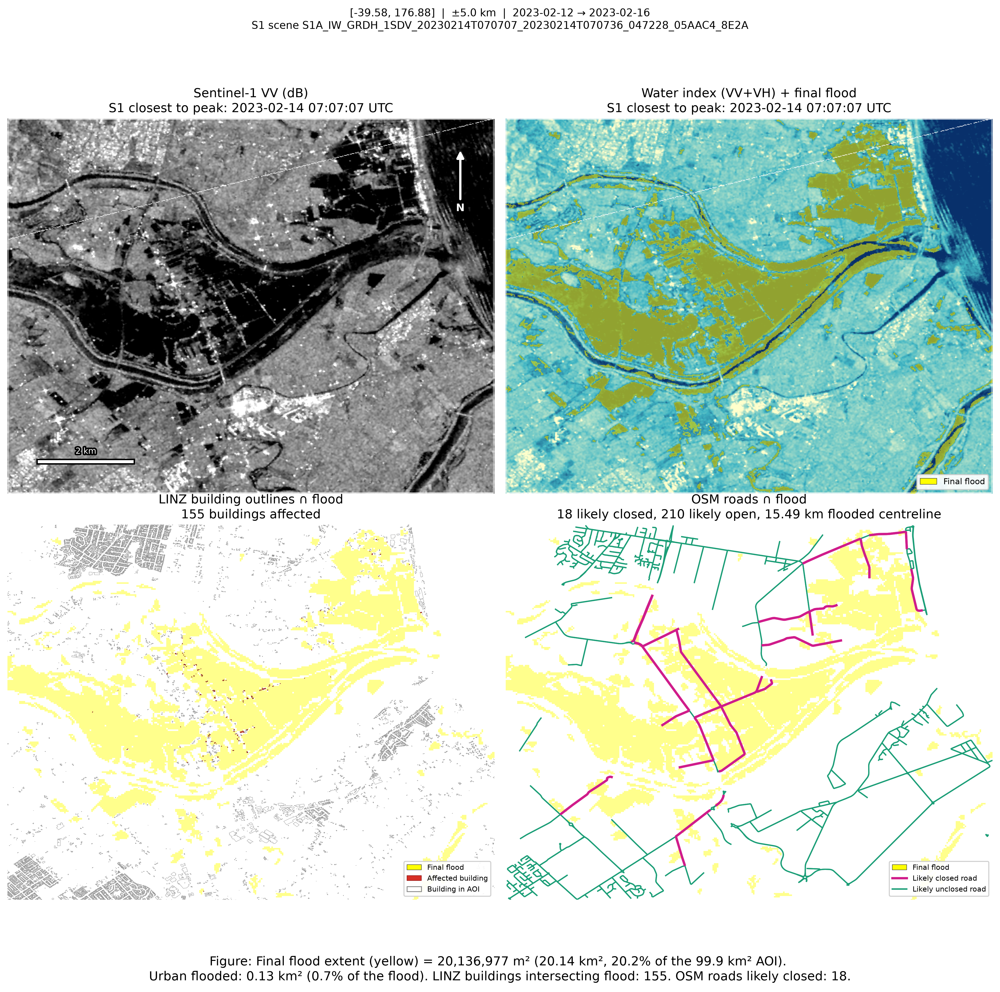
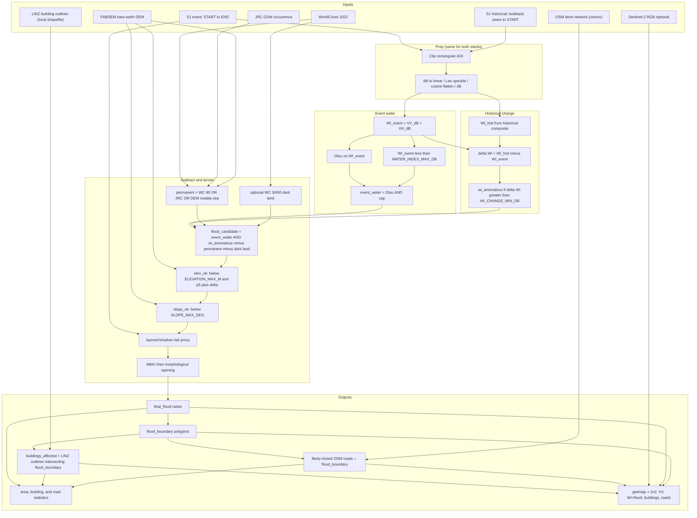

#  Geographically Informed Speculators (GIS)

GEOG761 group project: mapping **flood and inundation extent** after a disaster, as the entry point for choosing a sea-logistics / HA-DR site.

The Sentinel-1 notebook remains the lab-style reference. The map UI runs the **same flood flow** from calendar dates and a Leaflet AOI, without editing `layer_config.py` for coordinates or dates. Flood is event-window water that is also **darker than a multi-year historical Sentinel-1 mean**, not event WI alone.

---

## The problem

Selecting a suitable site for logistics supply from sea, immediately following a disaster event requiring HA/DR support.

**Scope:** focus on flood and inundation extent as the entry point.

- Ports may fail
- Beach landing becomes the fallback
- Roads destroyed
- Communities and islands cut off
- Survey data outdated
- Pre-event knowledge no longer reliable

---


## Observation and method

**Mapping flood extent with Sentinel-1** (`notebooks/01_sentinel1_layer.ipynb` or `processing/pipeline.py`). Notebook AOI/dates still live in `notebooks/layer_config.py`. The UI does not use those date/coordinate fields; it sends them over HTTP. Thresholds in `processing/defaults.py` match the notebook.

**Inputs**


| Input                            | Collection / product                                                                                                                              | Role                                                                                                                        |
| -------------------------------- | ------------------------------------------------------------------------------------------------------------------------------------------------- | --------------------------------------------------------------------------------------------------------------------------- |
| Sentinel-1 event stack           | `COPERNICUS/S1_GRD` IW, 10 m, `START_DATE`–`END_DATE`                                                                                             | Event composite; `WI_event = VV_dB + VH_dB`                                                                                 |
| Sentinel-1 historical stack      | Same collection, `HIST_LOOKBACK_YEARS` ending at `START_DATE`                                                                                     | Mean WI before the event (`WI_hist`). Event window is excluded                                                              |
| FABDEM (bare-earth DEM)          | `projects/sat-io/open-datasets/FABDEM`                                                                                                            | Elevation, slope, sea (nodata). GLO-30 with buildings/trees removed                                                         |
| ESA WorldCover 2021              | `ESA/WorldCover/v200/2021`                                                                                                                        | Permanent water (class 80); optional dark-land classes 50/60 (runways)                                                      |
| JRC Global Surface Water         | `JRC/GSW1_4/GlobalSurfaceWater` `occurrence`                                                                                                      | Permanent / frequent water                                                                                                  |
| Sentinel-2 RGB (optional figure) | `COPERNICUS/S2_SR_HARMONIZED`                                                                                                                     | Context RGB, not the flood classifier                                                                                       |
| LINZ NZ Building Outlines        | [LINZ layer 101290](https://data.linz.govt.nz/layer/101290-nz-building-outlines/), local shapefile at `data/nz-building/nz-building-outlines.shp` | Roof outlines (≥ 10 m²) from aerial imagery; counts buildings that touch the flood. Not on GEE; read locally with GeoPandas |
| OpenStreetMap drive network      | Overpass via `osmnx` (`network_type="drive"`)                                                                                                     | Named roads, lanes, bridge/tunnel tags, and a connected graph for likely-closed / detour checks (notebook 5e and UI)        |


**How a pixel becomes flood**

1. **Prep** — clip to a rectangular AOI; convert dB → linear power; Lee speckle filter; simplified cosine terrain flatten; back to dB. The **same** recipe is applied to the event stack and to the historical stack.
2. **Event water** — dual-pol index `WI = VV_dB + VH_dB`. Water if `WI_event < Otsu(WI_event)` **and** `WI_event < WATER_INDEX_MAX_DB`.
3. **Historical change** — `ΔWI = WI_hist − WI_event`. Keep pixels with `ΔWI > WI_CHANGE_MIN_DB` (`wi_anomalous`). Always-dark water and pavement stay near `ΔWI ≈ 0`; newly inundated land darkens.
4. **Flood candidate** — `event_water` **and** `wi_anomalous`, then drop WorldCover 80, JRC occurrence ≥ threshold, DEM nodata (open sea), and optional WorldCover 50/60.
5. **Terrain** — drop high ground (`ELEVATION_MAX_M` and optional height above AOI FABDEM p5) and slopes steeper than `SLOPE_MAX_DEG`; layover/shadow *risk proxy* from slope vs incidence angle. Elevation is **FABDEM** (bare earth), not raw Copernicus GLO-30 (DSM with buildings/trees).
6. **Clean** — minimum mapping unit, then a small morphological opening.
7. **Vectorise** — `final_flood` → `flood_boundary` polygons (`reduceToVectors`, 40 m, eight-connected).
8. **Building exposure** — LINZ outlines ∩ `flood_boundary` (see below).
9. **Road exposure** — OSM drive edges ∩ `flood_boundary`; likely-closed names, inundated carriageway area, in-AOI detours (notebook 5e and `processing/roads.py`).
10. **Output** — flood raster, boundary polygons, area / building / road stats, 2×2 figure.


### Counting affected buildings (LINZ ∩ flood)

Code: `processing/buildings.py`, used by notebook section 5d and the UI pipeline.

1. **Download.** Export *NZ Building Outlines* from the LINZ Data Service as a shapefile (WGS 84 or NZTM2000 both work) and unzip it into `data/nz-building/`. The path is `BUILDING_OUTLINES_PATH` in `notebooks/layer_config.py` and `processing/defaults.py`. Shapefile sidecars are gitignored.
2. **Clip to the AOI.** `gpd.read_file(path, bbox=AOI_BOUNDS)` reads only outlines inside the AOI rectangle (the national file is large), reprojected to WGS 84. This is `buildings_in_aoi`.
3. **Bring the flood to the client.** `flood_boundary` (Earth Engine `FeatureCollection`) is pulled with `getInfo()` and turned into a GeoDataFrame in WGS 84.
4. **Intersect.** `gpd.sjoin(buildings, flood, predicate="intersects")`. A building counts once if **any part** of its roof outline touches flood water; duplicates from multiple flood polygons are dropped on `building_i`. This is `buildings_affected`.
5. **Footprint area.** The affected outlines are overlaid with the flood polygons in **NZTM2000** (`EPSG:2193`) so the wetted roof area is in square metres (`buildings_affected_footprint_km2`). The count itself does not depend on the CRS.


| Stat key                           | Meaning                                       |
| ---------------------------------- | --------------------------------------------- |
| `buildings_in_aoi`                 | LINZ outlines inside the AOI rectangle        |
| `buildings_affected`               | Outlines intersecting `flood_boundary`        |
| `buildings_affected_pct`           | `buildings_affected / buildings_in_aoi × 100` |
| `buildings_affected_footprint_km2` | Area of outline ∩ flood, NZTM2000             |


The figure's bottom-left panel draws flood in yellow, AOI outlines in grey and affected outlines in red. The notebook map adds only the affected outlines as a layer (uploading every AOI outline to Earth Engine is slow).

**Read these numbers as exposure, not damage.** A building is counted even if only its edge touches a 10–40 m flood pixel, so the count leans high near flood boundaries. Outlines include garages and sheds and are not households. They also reflect the imagery date (for Hawke's Bay, 2023–2024), so buildings demolished after Gabrielle may still appear.

### Detecting likely-closed roads (OSM ∩ flood)

Code: `processing/roads.py`, used by notebook section 5e and the UI pipeline. Thresholds live in `processing/defaults.py` (`ROAD_CLOSED_MIN_LENGTH_M`, `ROAD_CLOSED_MIN_FRAC`, lane width, detour-name cap).

OSM is used instead of LINZ Topo50 because drive edges form a **connected graph**, with `name`, `highway`, `lanes`, `bridge`, and `tunnel`. That lets the notebook (1) skip elevated crossings that only look flooded because the centreline crosses the river, and (2) search an in-AOI detour after flooded edges are removed.

1. **Download.** `osmnx.graph_from_bbox` on `AOI_BOUNDS`, `network_type="drive"` (Overpass; first run needs network, later runs may use the OSMNx cache).
2. **Ground roads.** Drop edges tagged `bridge` or `tunnel`. Length and area are computed in **NZTM2000** (`EPSG:2193`).
3. **Intersect.** Flooded **length** = centreline ∩ `flood_boundary`. Flooded **area** = carriageway buffer ∩ flood. Buffer half-width = `lanes × 3.5 m / 2`, minimum 3.5 m.
4. **Likely closed.** An edge is likely closed if flooded length ≥ **50 m** **or** flooded length / edge length ≥ **30%**. Short slivers at the SAR/vector edge are ignored. Names are aggregated from OSM `name` (unnamed ways stay `(unnamed)`).
5. **Detour.** Copy the graph, remove every likely-closed edge, then `networkx.shortest_path` between the endpoints of the longest flooded edge per name. If a path exists, extra metres versus the original edge are stored; if not, the AOI graph has no alternative (the road may still be reachable from outside the box).


| Stat key                                        | Meaning                                         |
| ----------------------------------------------- | ----------------------------------------------- |
| `roads_in_aoi_km`                               | OSM drive centreline length in the AOI          |
| `roads_flooded_km`                              | Centreline length intersecting `flood_boundary` |
| `roads_flooded_area_km2`                        | Carriageway buffer ∩ flood, NZTM2000            |
| `roads_likely_closed_edges`                     | Edges meeting the 50 m / 30% rule               |
| `roads_likely_closed_names`                     | Count of unique OSM names among those edges     |
| `roads_likely_closed_name_list`                 | Those names, longest flooded first              |
| `roads_likely_unclosed_name_list`               | Remaining ground-road names, longest first      |
| `roads_with_aoi_detour` / `roads_no_aoi_detour` | Names with / without an in-AOI alternative      |
| `roads_detours`                                 | Per-name rows: flooded length, detour status, `detour_route` (named streets in order), extra metres |


The figure's bottom-right panel draws flood in yellow, **likely unclosed** roads in teal, and **likely closed** roads in magenta. The notebook map adds the closed edges as a magenta layer.

**Read these as a geometric/network proxy, not an official closure list.** SAR flood pixels are 10–40 m; a centreline has no width. Bridges can still be misclassified if OSM tags are missing. In-AOI “no detour” does not mean the rest of Hawke’s Bay is unreachable. Official NZTA / council closures are a different dataset.

Defaults: `HIST_LOOKBACK_YEARS = 2`, `WI_CHANGE_MIN_DB = 4` (WI is VV+VH, so about 2 dB per polarisation). Both live in `notebooks/layer_config.py` and `processing/defaults.py`.

SAR is used because it works through cloud (storms/cyclones). Sentinel-2 is a secondary optical check, not the primary flood classifier.

**Honesty:** Lecture 6 maps land vs water with **Random Forest on VV/VH**, not a water-index cut. WI + Otsu + a dB cap is a **project choice**. Inundation is event water that is also **darker than the multi-year mean WI**, minus a land-cover / JRC baseline, on low, flat ground. The historical layer is a **lookback composite**, not a matched pre-event / post-event pair (different orbits and seasons are averaged together).

### Example program output figure

The generated comparison figure is a **2 × 2** grid: Sentinel-1 VV (top left), water index with `final_flood` in yellow (top right), LINZ buildings ∩ flood (bottom left), OSM likely-closed vs likely-unclosed roads (bottom right).



---


## Architecture

The notebook (`01_sentinel1_layer.ipynb`) is the lab-style reference. The map UI runs the same flood flow in `processing/pipeline.py`.

Two Sentinel-1 stacks share one AOI and the same Lee / terrain-flatten steps:


| Stack      | Date filter                                       | Role                                           |
| ---------- | ------------------------------------------------- | ---------------------------------------------- |
| Event      | `START_DATE` → `END_DATE`                         | `WI_event`; Otsu ∩ dB cap → `event_water`      |
| Historical | `START_DATE − HIST_LOOKBACK_YEARS` → `START_DATE` | `WI_hist` (mean of all scenes in the lookback) |


Flood candidates are the **intersection**: currently water **and** darker than history (`ΔWI = WI_hist − WI_event > WI_CHANGE_MIN_DB`). Sentinel-2 is optional optical context, not the flood classifier. The comparison figure is a 2×2 of event Sentinel-1 VV, water index with `final_flood`, LINZ buildings, and OSM likely-closed roads.


```mermaid
flowchart TD
  subgraph IN["Inputs"]
    S1E["S1 event: START to END"]
    S1H["S1 historical: lookback years to START"]
    DEM["FABDEM bare-earth DEM"]
    WC["WorldCover 2021"]
    JRC["JRC GSW occurrence"]
    S2["Sentinel-2 RGB optional"]
    LINZ["LINZ building outlines (local shapefile)"]
    OSM["OSM drive network (osmnx)"]
  end
  subgraph PRE["Prep (same for both stacks)"]
    CLIP["Clip rectangular AOI"]
    LEE["dB to linear / Lee speckle / cosine flatten / dB"]
  end
  subgraph WTR["Event water"]
    WI["WI_event = VV_dB + VH_dB"]
    OTSU["Otsu on WI_event"]
    CAP["WI_event less than WATER_INDEX_MAX_DB"]
    EW["event_water = Otsu AND cap"]
  end
  subgraph CHG["Historical change"]
    WIH["WI_hist from historical composite"]
    DLT["delta WI = WI_hist minus WI_event"]
    ANO["wi_anomalous if delta WI greater than WI_CHANGE_MIN_DB"]
  end
  subgraph MASK["Subtract and terrain"]
    PERM["permanent = WC 80 OR JRC OR DEM nodata sea"]
    DARK["optional WC 50/60 dark land"]
    CAND["flood_candidate = event_water AND wi_anomalous minus permanent minus dark land"]
    ELEV["elev_ok: below ELEVATION_MAX_M and p5 plus delta"]
    SLP["slope_ok: below SLOPE_MAX_DEG"]
    LAY["layover/shadow risk proxy"]
    MMU["MMU then morphological opening"]
  end
  subgraph OUT["Outputs"]
    FF["final_flood raster"]
    POLY["flood_boundary polygons"]
    BLD["buildings_affected = LINZ outlines intersecting flood_boundary"]
    RD["likely-closed OSM roads ∩ flood_boundary"]
    STAT["area, building, and road statistics"]
    MAP["geemap + 2x2: VV, WI+flood, buildings, roads"]
  end
  S1E --> CLIP
  S1H --> CLIP
  CLIP --> LEE
  LEE --> WI
  LEE --> WIH
  WI --> OTSU --> EW
  WI --> CAP --> EW
  WIH --> DLT
  WI --> DLT --> ANO
  WC --> PERM
  JRC --> PERM
  DEM --> PERM
  WC --> DARK
  EW --> CAND
  ANO --> CAND
  PERM --> CAND
  DARK --> CAND
  DEM --> ELEV
  DEM --> SLP
  S1E --> LAY
  CAND --> ELEV --> SLP --> LAY --> MMU --> FF
  FF --> POLY
  FF --> STAT
  POLY --> BLD
  LINZ --> BLD
  POLY --> RD
  OSM --> RD
  BLD --> STAT
  RD --> STAT
  BLD --> MAP
  RD --> MAP
  S2 --> MAP
  FF --> MAP
  POLY --> MAP
```


**Logical proposition:** flood = event Sentinel-1 water (WI ∩ Otsu ∩ dB cap) **and** darker than the historical mean WI, minus permanent water, on low / flat ground.

**Event trigger (pitch context):** MetService / news. Implementation will start from a user-selected AOI and date range rather than a live alert feed.

---


## Map UI

A local FastAPI page (`ui/`) plus Leaflet. Dates, AOI, max slope, and max elevation are chosen in the browser. Historical lookback (`HIST_LOOKBACK_YEARS`) and the WI-change cut (`WI_CHANGE_MIN_DB`) stay in `processing/defaults.py` with the other processing thresholds. The notebook is **not** executed or modified.

### Design

Dark layout, gold accent. Team name **Geographically Informed Speculators** in the header. Optional logo at `ui/static/logo.png` or `assets/logo/logo.png` (missing image is hidden).

```text
┌─────────────────────────────────────────────────────────────┐
│  [logo]  Geographically Informed Speculators                │
│          Flood / inundation extent · GEOG761                │
│  [ Sentinel-1 SAR ]  [ Sentinel-2 U-Net ]                   │
├──────────────────┬──────────────────────────────────────────┤
│ Event window     │                                          │
│  start / end /   │           Leaflet map (this tab only)    │
│  peak (calendar) │   click = centred rectangle              │
│                  │   draw tool = custom box                 │
│ Area of interest │                                          │
│  half-width km   │                                          │
│  AOI text        │                                          │
│ Terrain filters  │                                          │
│  max slope (deg) │                                          │
│  max elev (m)    │                                          │
│  [Run flood…]    │                                          │
│  progress bar    │                                          │
│  step + elapsed  │                                          │
├──────────────────┴──────────────────────────────────────────┤
│ Figure — 2×2: VV, WI+flood, LINZ buildings, OSM roads       │
│ Key Flood Statistics — table (area, buildings, roads)       │
└─────────────────────────────────────────────────────────────┘
```

Tabs do not share form fields, Leaflet maps, or run state. Sentinel-1 still uses `POST /api/run`. The Sentinel-2 U-Net tab is a separate screen (own dates/AOI/map); its pipeline is not wired yet.


| Region     | What it does                                                                                                                                                                                                                                                                                                       |
| ---------- | ------------------------------------------------------------------------------------------------------------------------------------------------------------------------------------------------------------------------------------------------------------------------------------------------------------------ |
| Header     | Team name, optional logo, and tabs (**Sentinel-1 SAR** vs **Sentinel-2 U-Net**)                                                                                                                                                                                                                                    |
| Left panel | Native date pickers (start, end, optional peak; default peak is the window midpoint). Half-width (km) for click-to-centre mode. **Max slope (°)** and **max elevation (m)** (defaults `SLOPE_MAX_DEG=10`, `ELEVATION_MAX_M=25`). Run button. Live **progress** under the button: bar, `Step n/10: …`, elapsed time |
| Map        | OpenStreetMap. **Click** places a gold rectangle of ± half-width km. Leaflet.draw **rectangle** tool for a custom box. Selected bounds are shown as text                                                                                                                                                           |
| Results    | Same 2×2 figure as notebook section 5c (LINZ buildings ∩ flood; OSM likely-closed vs unclosed roads), then a **Key Flood Statistics** table: flood area, share of AOI, buildings, flooded road length/area, likely-closed name count and names |


Defaults match Cyclone Gabrielle at Hawke’s Bay Airport: 2023-02-01 → 2023-02-25, peak 2023-02-15, 5 km half-width, map centred at about `[-39.471, 176.869]`. Terrain defaults are **10°** max slope and **25 m** max elevation (`GET /api/defaults` loads these from `processing/defaults.py`).

### UI parameters

These controls are sent with `POST /api/run`. They replace the notebook’s `START_DATE` / `END_DATE` / `MAP_CENTER` / `AOI_RADIUS_KM` / `SLOPE_MAX_DEG` / `ELEVATION_MAX_M`. Other thresholds (`WATER_INDEX_MAX_DB`, `HIST_LOOKBACK_YEARS`, `WI_CHANGE_MIN_DB`, `ELEVATION_ABOVE_P5_M`, MMU, and so on) stay in `processing/defaults.py`.


| Control           | JSON field                       | Default                               | Role                                                                                                                              |
| ----------------- | -------------------------------- | ------------------------------------- | --------------------------------------------------------------------------------------------------------------------------------- |
| Start             | `start_date`                     | 2023-02-01                            | Inclusive start of the Sentinel-1 event window. Also the **end** of the historical lookback                                       |
| End               | `end_date`                       | 2023-02-25                            | Exclusive-style end of that window (must be after start). Event SAR scenes in this range are composited                           |
| Peak              | `peak_date`                      | 2023-02-15                            | Date used to pick the closest Sentinel-1 scene for metadata. If empty, the midpoint of start–end is used                          |
| Map click         | `center_lat`, `center_lon`       | none (click required unless you draw) | Centre of an axis-aligned rectangle. Builds the AOI together with half-width                                                      |
| Half-width (km)   | `half_km`                        | 5                                     | Distance north/south/east/west from the click. Only used in click-to-centre mode (same idea as notebook `AOI_RADIUS_KM`)          |
| Draw rectangle    | `west`, `south`, `east`, `north` | none                                  | Custom AOI box. If you draw, these bounds are used and half-width is ignored                                                      |
| Max slope (deg)   | `slope_max_deg`                  | 10                                    | Drop flood candidates on slopes **≥** this (steep ground is flood-implausible and layover/shadow-prone)                           |
| Max elevation (m) | `elevation_max_m`                | 25                                    | Drop flood candidates at or above this FABDEM height. A second relative cap (`ELEVATION_ABOVE_P5_M`) still applies in the backend |


**Progress steps (shown under the button):** (1) initialise Earth Engine, (2) search Sentinel-1, (3) Sentinel-2 RGB, (4) DEM / WorldCover / JRC, (5) Lee + terrain flatten, (6) water index + Otsu + historical WI change, (7) elevation / slope / layover masks, (8) vectorise flood polygons, (9) area statistics, LINZ buildings, and OSM likely-closed roads, (10) render figure. Earth Engine is lazy, so the bar can sit on steps 6, 7 and 9 for a while (step 9 also waits on Overpass). Only **one** run at a time; a second job waits.

**Optional Gemini analysis:** set any of `REPORT_ANALYSIS`, `REPORT_IMPLICATIONS`, `REPORT_UNCERTAINTIES`, `REPORT_CONCLUSION` to `True` in `notebooks/layer_config.py` to add those HTML sections under the statistics table (needs `GEMINI_KEY` in `.env`). All `False` skips the Gemini call.

### How to run

**Prerequisites**

- Python ≥ 3.13 and [uv](https://docs.astral.sh/uv/)
- A Google Earth Engine Cloud project (`EE_PROJECT`) and a **service-account JSON** at `GOOGLE_APPLICATION_CREDENTIALS` (see `.env.example`). Interactive `earthengine authenticate` is only a fallback if that env var is unset.

```bash
# Copy .env.example to .env and set EE_PROJECT + GOOGLE_APPLICATION_CREDENTIALS
# plus GEMINI_KEY if you want the HTML report.
```

**Start the server** (from the repo root):

```bash
# Values also come from repo-root .env (EE_PROJECT, GOOGLE_APPLICATION_CREDENTIALS).
uv sync
uv run uvicorn ui.app:app --reload --host 127.0.0.1 --port 8000
```

Open **[http://127.0.0.1:8000](http://127.0.0.1:8000)**

1. Set start / end / peak on the calendars (or keep the Gabrielle defaults).
2. Click the map, or draw a rectangle.
3. Click **Run flood mapping**.
4. Watch the progress box until the figure and stats appear below.

Jobs usually take **several minutes**. `--reload` picks up Python changes; refresh the browser for HTML/CSS/JS. API: `POST /api/run` then poll `GET /api/job/{job_id}` (status, progress, result).

---


## Expected product and risks

**Product**

- A map of flood and inundation extent for a chosen AOI and **event** date range, from Sentinel-1 versus a multi-year historical mean (optional Sentinel-2 RGB for context).
- A notebook or GitHub repository containing the code.
- Run on past flood events to show the method works.
- A partner can adapt it to their own SAR data.

**Risks:** revisit rate, training data, compute limits.

---


## Course mapping


| Pipeline step                                                    | Course source                                 |
| ---------------------------------------------------------------- | --------------------------------------------- |
| GEE + geemap ingest and map display                              | Lab 1                                         |
| Sentinel-2 pixel ML, spectral indices (e.g. NDWI), Random Forest | Lecture 2, Lab 2                              |
| Cloud-cleared Sentinel-2 composite                               | Lab 3                                         |
| Sentinel-1 land vs water (VV/VH, RF, speckle `focal_mean`)       | Lecture 6 (same exercise in Lecture 8)        |
| Event WI vs historical mean WI (change mask)                     | Project novelty (not a 761 exercise)          |
| Optional U-Net surface water on 6-band Sentinel-2                | Lab 5 (deep learning idea: Lecture 5 / Lab 4) |
| DEM keep low / flat pixels                                       | Extra GIS prior (not a 761 exercise)          |
| LINZ building outlines ∩ flood (exposure count)                  | Project novelty (vector overlay)              |
| OSM likely-closed roads ∩ flood (names, area, detour)            | Project novelty (notebook 5e + UI pipeline)   |
| Fusion overlay                                                   | Project novelty                               |


**Honesty line:** Lecture 6 classifies land vs water with **Random Forest on VV/VH**. This project's S1 notebook uses a **VV+VH water index**, **Otsu**, a **fixed dB cap**, and a **historical mean-WI change mask**, then WorldCover/JRC/DEM filters. That threshold-plus-change path is a project choice, not the lecture classifier.

---


## Repository layout

```text
GEOG761-GIS/
  README.md
  pyproject.toml
  .env.example                 # EE_PROJECT
  assets/logo/                 # team logo (optional)
  notebooks/                   # GEE / geemap layer tests
    layer_config.py            # notebook AOI, dates, thresholds (incl. LINZ building path)
    01_sentinel1_layer.ipynb   # S1 flood reference (5d buildings, 5e OSM roads)
    02_sentinel2_layer.ipynb
    03_dem_layer.ipynb
  data/nz-building/            # local LINZ NZ Building Outlines (not committed)
  processing/                  # UI backend: same S1 flood flow as 01_
    buildings.py               # LINZ outlines ∩ flood
    roads.py                   # OSM drive ∩ flood (likely-closed, detours)
  ui/                          # FastAPI + Leaflet calendar / map
    app.py
    static/
```

