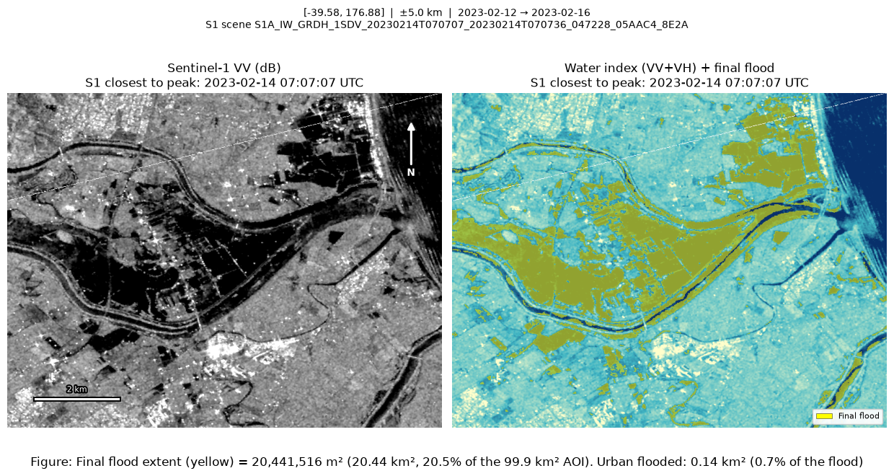
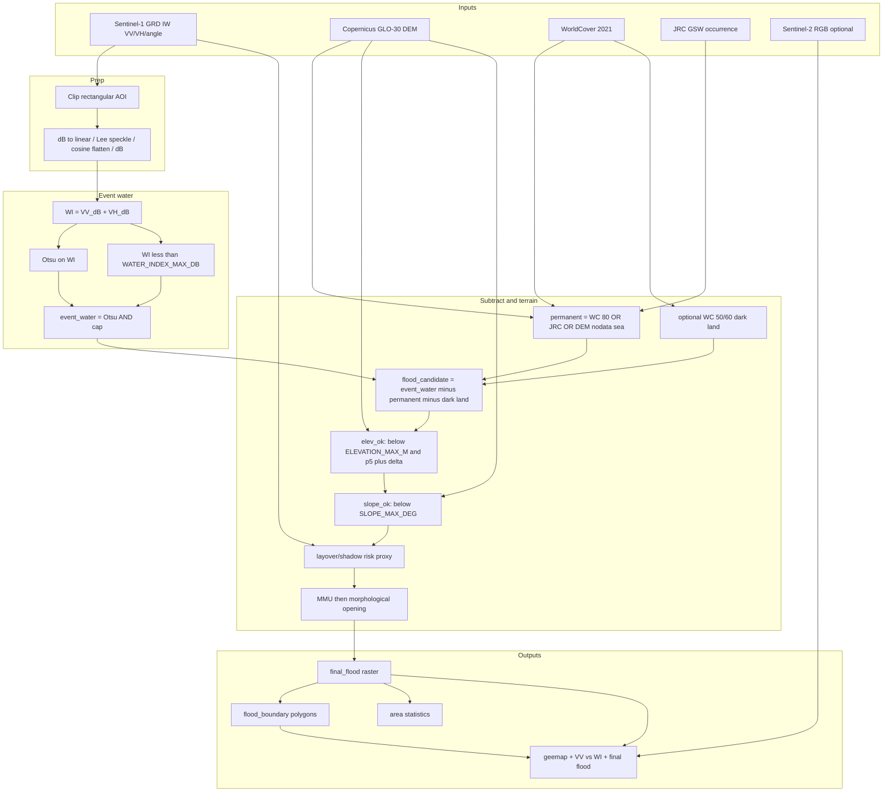

#  Geographically Informed Speculators (GIS)

GEOG761 group project: mapping **flood and inundation extent** after a disaster, as the entry point for choosing a sea-logistics / HA-DR site.

The Sentinel-1 notebook remains the lab-style reference. The map UI runs the **same flood flow** from calendar dates and a Leaflet AOI, without editing `layer_config.py` for coordinates or dates.

---

## The problem

Selecting a suitable site for logistics supply from sea, immediately following a disaster event requiring HA/DR support.

**Scope:** focus on flood and inundation extent as the entry point.

- Ports may fail
- Beach landing becomes the fallback
- Roads destroyed
- Communities and islands cut off
- Survey data outdated
- Pre-event knowledge no longer reliable

---

## Observation and method

**Mapping flood extent with Sentinel-1** (`notebooks/01_sentinel1_layer.ipynb` or `processing/pipeline.py`). Notebook AOI/dates still live in `notebooks/layer_config.py`. The UI does not use those date/coordinate fields; it sends them over HTTP. Thresholds in `processing/defaults.py` match the notebook.

**Inputs**


| Input                               | Collection / product                                                | Role                                                                   |
| ----------------------------------- | ------------------------------------------------------------------- | ---------------------------------------------------------------------- |
| Sentinel-1 GRD IW VV + VH + `angle` | `COPERNICUS/S1_GRD` (descending, 10 m) over `START_DATE`–`END_DATE` | Event SAR (no pre-event stack)                                         |
| Copernicus DEM GLO-30               | `COPERNICUS/DEM/GLO30`                                              | Elevation, slope, sea (nodata)                                         |
| ESA WorldCover 2021                 | `ESA/WorldCover/v200/2021`                                          | Permanent water (class 80); optional dark-land classes 50/60 (runways) |
| JRC Global Surface Water            | `JRC/GSW1_4/GlobalSurfaceWater` `occurrence`                        | Permanent / frequent water                                             |
| Sentinel-2 RGB (optional figure)    | `COPERNICUS/S2_SR_HARMONIZED`                                       | Side-by-side RGB vs flood boundary                                     |


**How a pixel becomes flood**

1. **Prep** — clip to a rectangular AOI; convert dB → linear power; Lee speckle filter; simplified cosine terrain flatten; back to dB.
2. **Event water** — dual-pol index `WI = VV_dB + VH_dB`. Water if `WI < Otsu(WI)` **and** `WI < WATER_INDEX_MAX_DB`.
3. **Not permanent** — drop WorldCover 80, JRC occurrence ≥ threshold, and DEM nodata (open sea). Optionally drop WorldCover 50/60.
4. **Terrain** — drop high ground (`ELEVATION_MAX_M` and optional height above AOI DEM p5) and slopes steeper than `SLOPE_MAX_DEG`; layover/shadow *risk proxy* from slope vs incidence angle.
5. **Clean** — minimum mapping unit, then a small morphological opening.
6. **Output** — flood raster, boundary polygons, area stats, VV / WI+flood comparison figure.

SAR is used because it works through cloud (storms/cyclones). Sentinel-2 is a secondary optical check, not the primary flood classifier.

**Honesty:** Lecture 6 maps land vs water with **Random Forest on VV/VH**, not a water-index cut. WI + Otsu + a dB cap is a **project choice**. There is no pre/post SAR difference layer in this notebook; inundation is event water minus a land-cover / JRC baseline on low, flat ground.

### Example program output

The generated comparison figure shows the Sentinel-1 VV composite on the left and the water index with the final flood extent overlaid in yellow on the right.



---

## Draft architecture

The notebook (`01_sentinel1_layer.ipynb`) is the lab-style reference. The map UI runs the same flood flow in `processing/pipeline.py`. Sentinel-2 is optional optical context, not the flood classifier. The comparison figure is Sentinel-1 VV and water index with `final_flood` overlaid.


```mermaid
flowchart TD
  subgraph IN["Inputs"]
    S1["Sentinel-1 GRD IW VV/VH/angle"]
    DEM["Copernicus GLO-30 DEM"]
    WC["WorldCover 2021"]
    JRC["JRC GSW occurrence"]
    S2["Sentinel-2 RGB optional"]
  end
  subgraph PRE["Prep"]
    CLIP["Clip rectangular AOI"]
    LEE["dB to linear / Lee speckle / cosine flatten / dB"]
  end
  subgraph WTR["Event water"]
    WI["WI = VV_dB + VH_dB"]
    OTSU["Otsu on WI"]
    CAP["WI less than WATER_INDEX_MAX_DB"]
    EW["event_water = Otsu AND cap"]
  end
  subgraph MASK["Subtract and terrain"]
    PERM["permanent = WC 80 OR JRC OR DEM nodata sea"]
    DARK["optional WC 50/60 dark land"]
    CAND["flood_candidate = event_water minus permanent minus dark land"]
    ELEV["elev_ok: below ELEVATION_MAX_M and p5 plus delta"]
    SLP["slope_ok: below SLOPE_MAX_DEG"]
    LAY["layover/shadow risk proxy"]
    MMU["MMU then morphological opening"]
  end
  subgraph OUT["Outputs"]
    FF["final_flood raster"]
    POLY["flood_boundary polygons"]
    STAT["area statistics"]
    MAP["geemap + VV vs WI + final flood"]
  end
  S1 --> CLIP --> LEE --> WI
  WI --> OTSU --> EW
  WI --> CAP --> EW
  WC --> PERM
  JRC --> PERM
  DEM --> PERM
  WC --> DARK
  EW --> CAND
  PERM --> CAND
  DARK --> CAND
  DEM --> ELEV
  DEM --> SLP
  S1 --> LAY
  CAND --> ELEV --> SLP --> LAY --> MMU --> FF
  FF --> POLY
  FF --> STAT
  S2 --> MAP
  FF --> MAP
  POLY --> MAP
```


**Logical proposition:** flood = event Sentinel-1 water (WI ∩ Otsu ∩ dB cap), minus permanent water, on low / flat ground.

**Event trigger (pitch context):** MetService / news. Implementation will start from a user-selected AOI and date range rather than a live alert feed.

---

## Map UI

A local FastAPI page (`ui/`) plus Leaflet. Dates, AOI, max slope, and max elevation are chosen in the browser. Other processing thresholds stay in `processing/defaults.py`. The notebook is **not** executed or modified.

### Design

Dark layout, gold accent. Team name **Geographically Informed Speculators** in the header. Optional logo at `ui/static/logo.png` or `assets/logo/logo.png` (missing image is hidden).

```text
┌─────────────────────────────────────────────────────────────┐
│  [logo]  Geographically Informed Speculators                │
│          Sentinel-1 flood / inundation extent · GEOG761     │
├──────────────────┬──────────────────────────────────────────┤
│ Event window     │                                          │
│  start / end /   │           Leaflet map                    │
│  peak (calendar) │   click = centred rectangle              │
│                  │   draw tool = custom box                 │
│ Area of interest │                                          │
│  half-width km   │                                          │
│  AOI text        │                                          │
│ Terrain filters  │                                          │
│  max slope (deg) │                                          │
│  max elev (m)    │                                          │
│  [Run flood…]    │                                          │
│  progress bar    │                                          │
│  step + elapsed  │                                          │
├──────────────────┴──────────────────────────────────────────┤
│ Figure — two-panel PNG (S1 VV, WI + flood)                  │
│ Stats  — JSON (areas, meta; report is null for now)         │
└─────────────────────────────────────────────────────────────┘
```


| Region     | What it does                                                                                                                                                                                                                                                                                                       |
| ---------- | ------------------------------------------------------------------------------------------------------------------------------------------------------------------------------------------------------------------------------------------------------------------------------------------------------------------ |
| Header     | Team name and optional logo                                                                                                                                                                                                                                                                                        |
| Left panel | Native date pickers (start, end, optional peak; default peak is the window midpoint). Half-width (km) for click-to-centre mode. **Max slope (°)** and **max elevation (m)** (defaults `SLOPE_MAX_DEG=10`, `ELEVATION_MAX_M=25`). Run button. Live **progress** under the button: bar, `Step n/10: …`, elapsed time |
| Map        | OpenStreetMap. **Click** places a gold rectangle of ± half-width km. Leaflet.draw **rectangle** tool for a custom box. Selected bounds are shown as text                                                                                                                                                           |
| Results    | Same two-panel figure as the last cells of `01_sentinel1_layer.ipynb`, then area stats + meta as JSON                                                                                                                                                                                                              |


Defaults match Cyclone Gabrielle at Hawke’s Bay Airport: 2023-02-01 → 2023-02-25, peak 2023-02-15, 5 km half-width, map centred at about `[-39.471, 176.869]`. Terrain defaults are **10°** max slope and **25 m** max elevation (`GET /api/defaults` loads these from `processing/defaults.py`).

### UI parameters

These controls are sent with `POST /api/run`. They replace the notebook’s `START_DATE` / `END_DATE` / `MAP_CENTER` / `AOI_RADIUS_KM` / `SLOPE_MAX_DEG` / `ELEVATION_MAX_M`. Other thresholds (`WATER_INDEX_MAX_DB`, `ELEVATION_ABOVE_P5_M`, MMU, and so on) stay in `processing/defaults.py`.


| Control           | JSON field                       | Default                               | Role                                                                                                                                      |
| ----------------- | -------------------------------- | ------------------------------------- | ----------------------------------------------------------------------------------------------------------------------------------------- |
| Start             | `start_date`                     | 2023-02-01                            | Inclusive start of the Sentinel-1 (and Sentinel-2 RGB) event window                                                                       |
| End               | `end_date`                       | 2023-02-25                            | Exclusive-style end of that window (must be after start). SAR scenes in this range are composited                                         |
| Peak              | `peak_date`                      | 2023-02-15                            | Date used to pick the closest Sentinel-1 scene for metadata. If empty, the midpoint of start–end is used                                  |
| Map click         | `center_lat`, `center_lon`       | none (click required unless you draw) | Centre of an axis-aligned rectangle. Builds the AOI together with half-width                                                              |
| Half-width (km)   | `half_km`                        | 5                                     | Distance north/south/east/west from the click. Only used in click-to-centre mode (same idea as notebook `AOI_RADIUS_KM`)                  |
| Draw rectangle    | `west`, `south`, `east`, `north` | none                                  | Custom AOI box. If you draw, these bounds are used and half-width is ignored                                                              |
| Max slope (deg)   | `slope_max_deg`                  | 10                                    | Drop flood candidates on slopes **≥** this (steep ground is flood-implausible and layover/shadow-prone)                                   |
| Max elevation (m) | `elevation_max_m`                | 25                                    | Drop flood candidates at or above this Copernicus DEM height. A second relative cap (`ELEVATION_ABOVE_P5_M`) still applies in the backend |


**Progress steps (shown under the button):** (1) initialise Earth Engine, (2) search Sentinel-1, (3) Sentinel-2 RGB, (4) DEM / WorldCover / JRC, (5) Lee + terrain flatten, (6) water index + Otsu, (7) elevation / slope / layover masks, (8) vectorise flood polygons, (9) area statistics, (10) render figure. Earth Engine is lazy, so the bar can sit on steps 6, 7 and 9 for a while. Only **one** run at a time; a second job waits.

**Later:** POST the figure (PNG base64) and stats JSON to Anthropic (Claude) and fill `report`. That field is currently `null`.

### How to run

**Prerequisites**

- Python ≥ 3.13 and [uv](https://docs.astral.sh/uv/)
- A Google Earth Engine Cloud project you can use, and a one-time local login:

```bash
uv run earthengine authenticate
```

**Start the server** (from the repo root):

```bash
# Optional; default is geog761-dongwook (see .env.example)
export EE_PROJECT=geog761-dongwook

uv sync
uv run uvicorn ui.app:app --reload --host 127.0.0.1 --port 8000
```

Open **[http://127.0.0.1:8000](http://127.0.0.1:8000)**

1. Set start / end / peak on the calendars (or keep the Gabrielle defaults).
2. Click the map, or draw a rectangle.
3. Click **Run flood mapping**.
4. Watch the progress box until the figure and stats appear below.

Jobs usually take **several minutes**. `--reload` picks up Python changes; refresh the browser for HTML/CSS/JS. API: `POST /api/run` then poll `GET /api/job/{job_id}` (status, progress, result).

---

## Expected product and risks

**Product**

- A map of flood and inundation extent for a chosen AOI and **event** date range, from Sentinel-1 (optional Sentinel-2 RGB for context).
- A notebook or GitHub repository containing the code.
- Run on past flood events to show the method works.
- A partner can adapt it to their own SAR data.

**Risks:** revisit rate, training data, compute limits.

---

## Course mapping


| Pipeline step                                                    | Course source                                 |
| ---------------------------------------------------------------- | --------------------------------------------- |
| GEE + geemap ingest and map display                              | Lab 1                                         |
| Sentinel-2 pixel ML, spectral indices (e.g. NDWI), Random Forest | Lecture 2, Lab 2                              |
| Cloud-cleared Sentinel-2 composite                               | Lab 3                                         |
| Sentinel-1 land vs water (VV/VH, RF, speckle `focal_mean`)       | Lecture 6 (same exercise in Lecture 8)        |
| Optional U-Net surface water on 6-band Sentinel-2                | Lab 5 (deep learning idea: Lecture 5 / Lab 4) |
| DEM keep low / flat pixels                                       | Extra GIS prior (not a 761 exercise)          |
| Fusion overlay                                                   | Project novelty                               |


**Honesty line:** Lecture 6 classifies land vs water with **Random Forest on VV/VH**. This project's S1 notebook uses a **VV+VH water index**, **Otsu**, and a **fixed dB cap** (AND), then WorldCover/JRC/DEM filters. That threshold path is a project choice, not the lecture classifier.

---

## Repository layout

```text
GEOG761-GIS/
  README.md
  pyproject.toml
  .env.example                 # EE_PROJECT
  assets/logo/                 # team logo (optional)
  notebooks/                   # GEE / geemap layer tests (unchanged for the UI)
    layer_config.py            # notebook AOI, dates, thresholds
    01_sentinel1_layer.ipynb   # S1 flood reference notebook
    02_sentinel2_layer.ipynb
    03_dem_layer.ipynb
  processing/                  # UI backend: same S1 flood flow as 01_
  ui/                          # FastAPI + Leaflet calendar / map
    app.py
    static/
```

