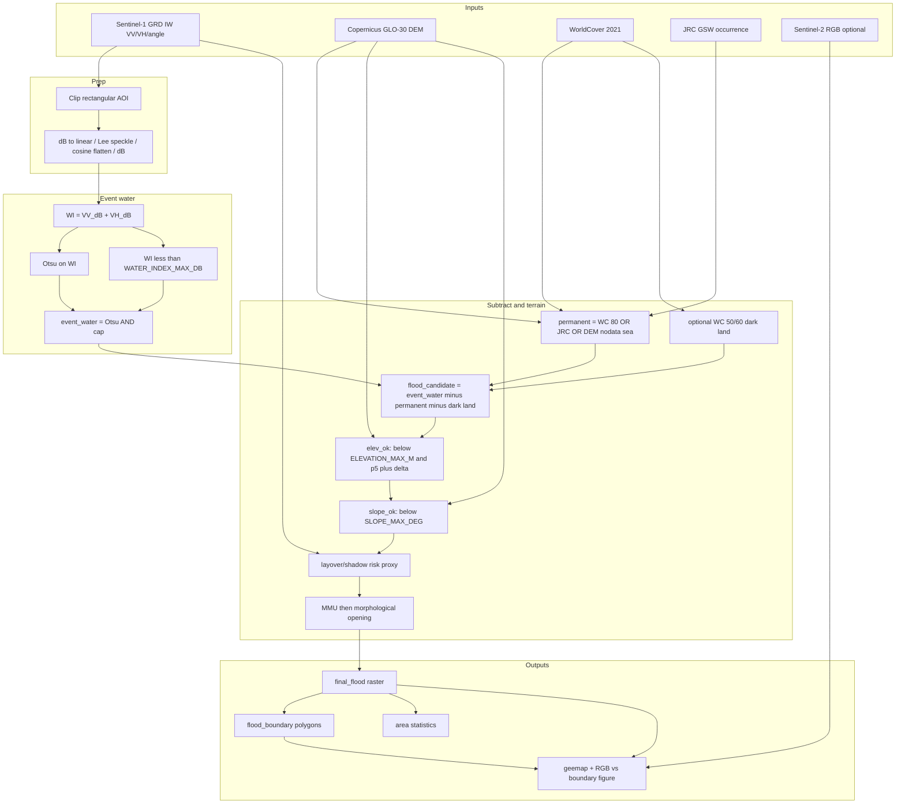

#  Geographically Informed Speculators (GIS)
GEOG761 group project: mapping **flood and inundation extent** after a disaster, as the entry point for choosing a sea-logistics / HA-DR site.

The Sentinel-1 notebook maps flood extent. A separate Gemini module (`llm/report.py`) turns the last figure and stats into a short report. The map UI will be added later.

---

## The problem

Selecting a suitable site for logistics supply from sea, immediately following a disaster event requiring HA/DR support.

**Scope:** focus on flood and inundation extent as the entry point.

- Ports may fail
- Beach landing becomes the fallback
- Roads destroyed
- Communities and islands cut off
- Survey data outdated
- Pre-event knowledge no longer reliable

---


## Observation and method

**Mapping flood extent with Sentinel-1** (`notebooks/01_sentinel1_layer.ipynb`). AOI, dates, and thresholds live in `notebooks/layer_config.py`.

**Inputs**

| Input | Collection / product | Role |
|---|---|---|
| Sentinel-1 GRD IW VV + VH + `angle` | `COPERNICUS/S1_GRD` (descending, 10 m) over `START_DATE`–`END_DATE` | Event SAR (no pre-event stack) |
| Copernicus DEM GLO-30 | `COPERNICUS/DEM/GLO30` | Elevation, slope, sea (nodata) |
| ESA WorldCover 2021 | `ESA/WorldCover/v200/2021` | Permanent water (class 80); optional dark-land classes 50/60 (runways) |
| JRC Global Surface Water | `JRC/GSW1_4/GlobalSurfaceWater` `occurrence` | Permanent / frequent water |
| Sentinel-2 RGB (optional figure) | `COPERNICUS/S2_SR_HARMONIZED` | Side-by-side RGB vs flood boundary |

**How a pixel becomes flood**

1. **Prep** — clip to a rectangular AOI; convert dB → linear power; Lee speckle filter; simplified cosine terrain flatten; back to dB.
2. **Event water** — dual-pol index `WI = VV_dB + VH_dB`. Water if `WI < Otsu(WI)` **and** `WI < WATER_INDEX_MAX_DB`.
3. **Not permanent** — drop WorldCover 80, JRC occurrence ≥ threshold, and DEM nodata (open sea). Optionally drop WorldCover 50/60.
4. **Terrain** — drop high ground (`ELEVATION_MAX_M` and optional height above AOI DEM p5) and slopes steeper than `SLOPE_MAX_DEG`; layover/shadow *risk proxy* from slope vs incidence angle.
5. **Clean** — minimum mapping unit, then a small morphological opening.
6. **Output** — flood raster, boundary polygons, area stats, RGB comparison figure.

SAR is used because it works through cloud (storms/cyclones). Sentinel-2 is a secondary optical check, not the primary flood classifier.

**Honesty:** Lecture 6 maps land vs water with **Random Forest on VV/VH**, not a water-index cut. WI + Otsu + a dB cap is a **project choice**. There is no pre/post SAR difference layer in this notebook; inundation is event water minus a land-cover / JRC baseline on low, flat ground.

---


## Draft architecture

Current code path is `01_sentinel1_layer.ipynb` (config in `layer_config.py`). Sentinel-2 is only used for the RGB comparison figure, not for classifying flood.


```mermaid
flowchart TD
  subgraph IN["Inputs"]
    S1["Sentinel-1 GRD IW VV/VH/angle"]
    DEM["Copernicus GLO-30 DEM"]
    WC["WorldCover 2021"]
    JRC["JRC GSW occurrence"]
    S2["Sentinel-2 RGB optional"]
  end
  subgraph PRE["Prep"]
    CLIP["Clip rectangular AOI"]
    LEE["dB to linear / Lee speckle / cosine flatten / dB"]
  end
  subgraph WTR["Event water"]
    WI["WI = VV_dB + VH_dB"]
    OTSU["Otsu on WI"]
    CAP["WI less than WATER_INDEX_MAX_DB"]
    EW["event_water = Otsu AND cap"]
  end
  subgraph MASK["Subtract and terrain"]
    PERM["permanent = WC 80 OR JRC OR DEM nodata sea"]
    DARK["optional WC 50/60 dark land"]
    CAND["flood_candidate = event_water minus permanent minus dark land"]
    ELEV["elev_ok: below ELEVATION_MAX_M and p5 plus delta"]
    SLP["slope_ok: below SLOPE_MAX_DEG"]
    LAY["layover/shadow risk proxy"]
    MMU["MMU then morphological opening"]
  end
  subgraph OUT["Outputs"]
    FF["final_flood raster"]
    POLY["flood_boundary polygons"]
    STAT["area statistics"]
    MAP["geemap + RGB vs boundary figure"]
  end
  S1 --> CLIP --> LEE --> WI
  WI --> OTSU --> EW
  WI --> CAP --> EW
  WC --> PERM
  JRC --> PERM
  DEM --> PERM
  WC --> DARK
  EW --> CAND
  PERM --> CAND
  DARK --> CAND
  DEM --> ELEV
  DEM --> SLP
  S1 --> LAY
  CAND --> ELEV --> SLP --> LAY --> MMU --> FF
  FF --> POLY
  FF --> STAT
  S2 --> MAP
  FF --> MAP
  POLY --> MAP
```


**Logical proposition:** flood = event Sentinel-1 water (WI ∩ Otsu ∩ dB cap), minus permanent water, on low / flat ground.

**Event trigger (pitch context):** MetService / news. Implementation will start from a user-selected AOI and date range rather than a live alert feed.

---


## Planned UI (not implemented yet)

- Team name **Geographically Informed Speculators** and logo at the top of the page. Drop the logo in `[assets/logo/](assets/logo/)` (see that folder’s README).
- Input: select an area of interest (AOI) on the map.
- Processing module: clip, cloud mask, speckle filter, course models, fusion.
- Output on the same UI: geemap flood polygon / layers, plus a short report.
- **Gemini** turns the comparison figure plus area stats into an **HTML** briefing (`llm/report.py`; key in `.env` as `GEMINI_KEY`).

---


## Expected product and risks

**Product**

- A map of flood and inundation extent for a chosen AOI and **event** date range, from Sentinel-1 (optional Sentinel-2 RGB for context).
- A notebook or GitHub repository containing the code.
- Run on past flood events to show the method works.
- A partner can adapt it to their own SAR data.

**Risks:** revisit rate, training data, compute limits.

---


## Course mapping


| Pipeline step                                                    | Course source                                 |
| ---------------------------------------------------------------- | --------------------------------------------- |
| GEE + geemap ingest and map display                              | Lab 1                                         |
| Sentinel-2 pixel ML, spectral indices (e.g. NDWI), Random Forest | Lecture 2, Lab 2                              |
| Cloud-cleared Sentinel-2 composite                               | Lab 3                                         |
| Sentinel-1 land vs water (VV/VH, RF, speckle `focal_mean`)       | Lecture 6 (same exercise in Lecture 8)        |
| Optional U-Net surface water on 6-band Sentinel-2                | Lab 5 (deep learning idea: Lecture 5 / Lab 4) |
| DEM keep low / flat pixels                                       | Extra GIS prior (not a 761 exercise)          |
| Fusion overlay                                                   | Project novelty                               |


**Honesty line:** Lecture 6 classifies land vs water with **Random Forest on VV/VH**. This project's S1 notebook uses a **VV+VH water index**, **Otsu**, and a **fixed dB cap** (AND), then WorldCover/JRC/DEM filters. That threshold path is a project choice, not the lecture classifier.

---


## Repository layout

```text
GEOG761-GIS/
  README.md
  pyproject.toml
  .env.example                 # GEMINI_KEY placeholder (real key stays in .env)
  assets/logo/                 # team logo
  llm/                         # Gemini report from figure + stats (not in the notebook)
    report.py
  notebooks/
    layer_config.py
    01_sentinel1_layer.ipynb   # last cells: figure, stats, then llm.generate_flood_report
    02_sentinel2_layer.ipynb
    03_dem_layer.ipynb
```

Copy `.env.example` to `.env` and set `GEMINI_KEY`. After the two-panel figure cell, run the LLM report cell (needs `fig` and `stats` in memory). The report is **HTML** (comparison figure embedded). Optional: `GEMINI_MODEL` (default `gemini-2.5-flash`).

Later: `ui/`, `processing/`, and `output/` when the map UI and fusion pipeline are added.